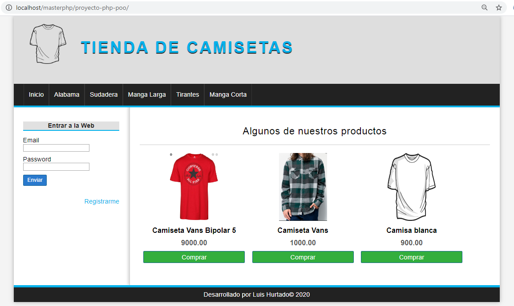
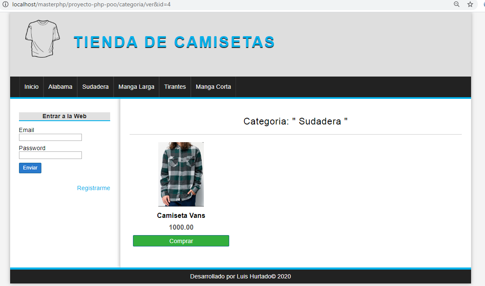
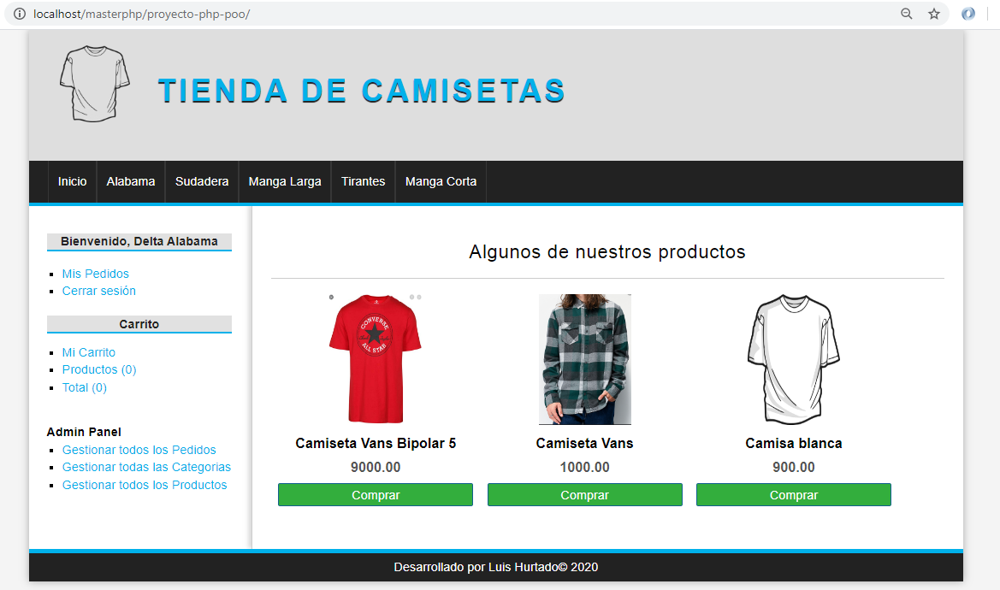
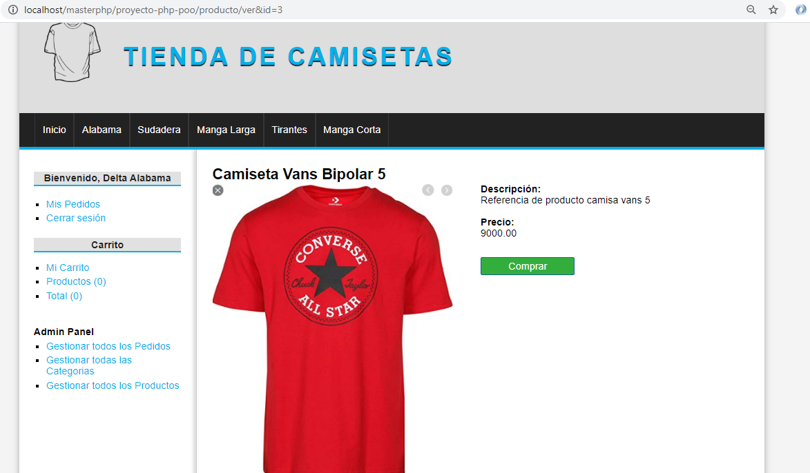
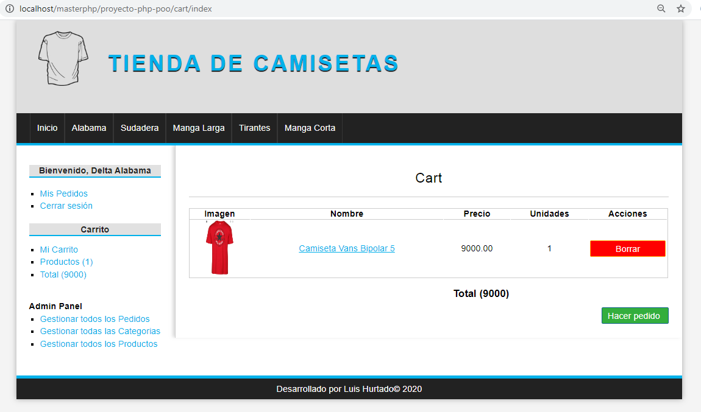
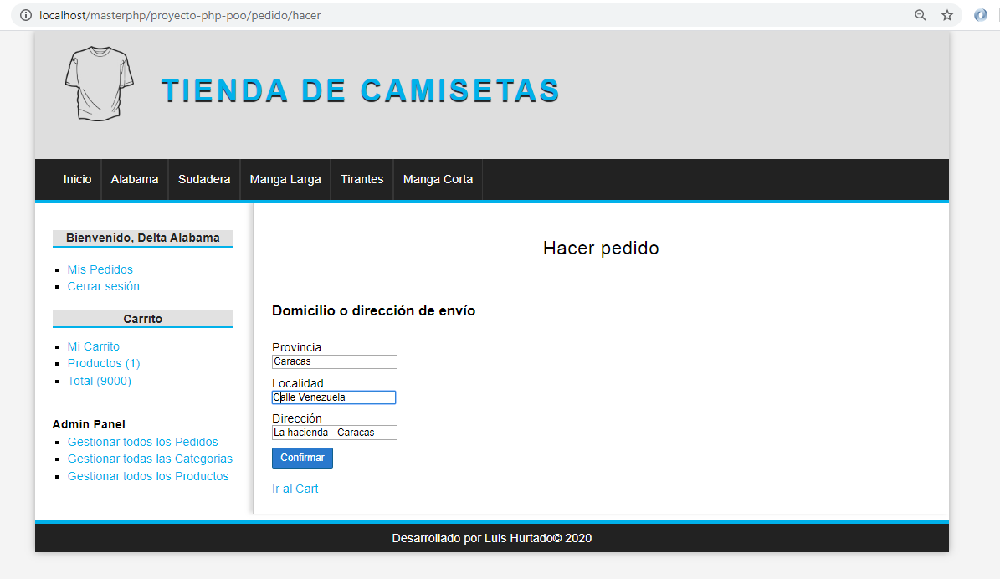
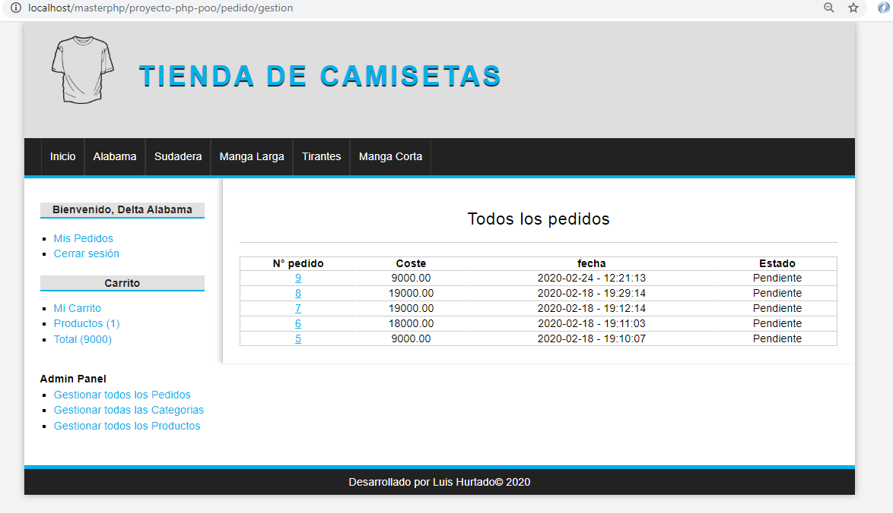
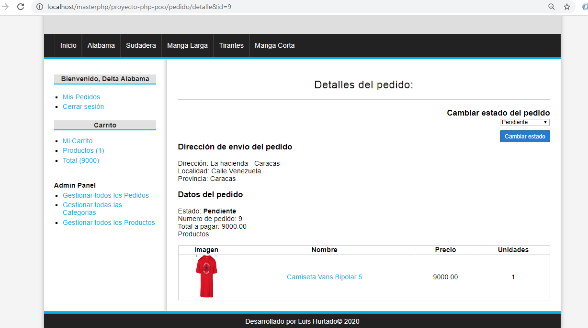
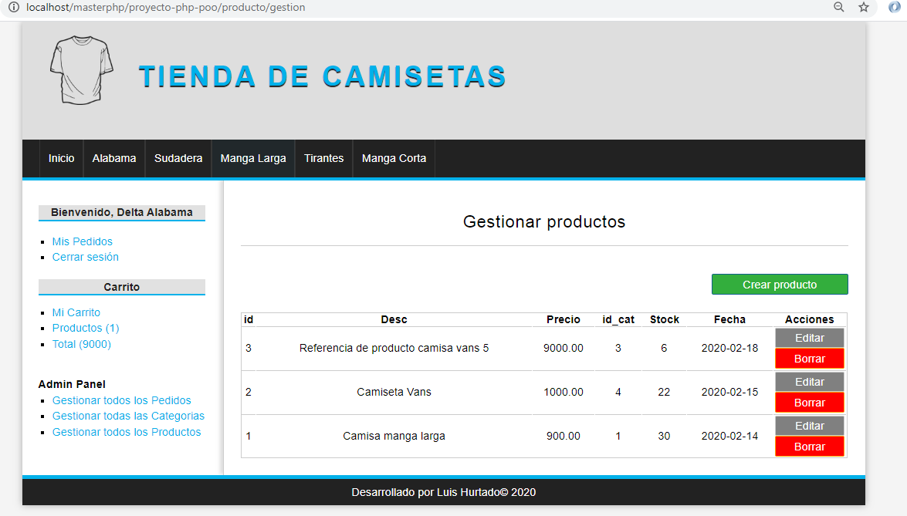
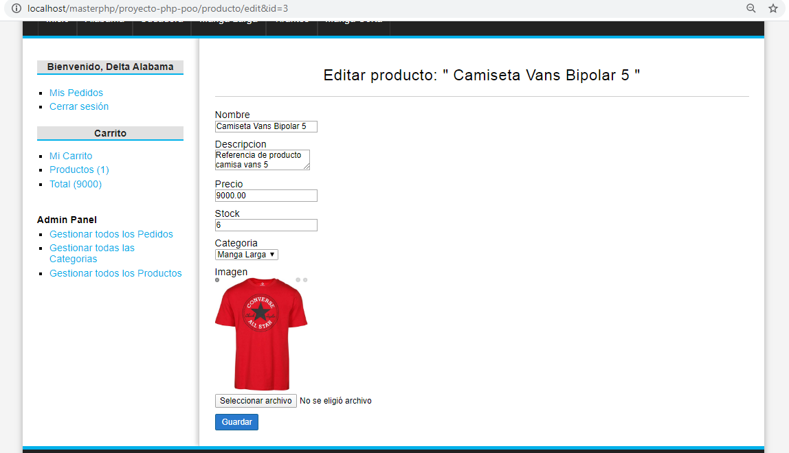

## Proyecto PHP - Tienda Online de Camisetas - Web con PHP orientado a objetos (POO)

### Descripción:
Tienda online con motivo de tienda de camisetas hecha cobn programación orientada a objetos (POO) y base de datos en MySQL

- Registro, login y logout de usuarios.
- Niveles de usuario: Administrador y usuario.
- Creación de ordenes / items (camisetas) / Categorias según nivel de usuario.
- Creación, listado, edición y borrado de items (camisetas) visible para todos los niveles de usuarios y tambien dependiendo de si el usuario es administrador para ejecutar ciertas acciones como administración de categorías, items, cambio de status de ordenes.
- Carrito de compras.
- Confirmacion de pedidos.
- Vista de mis pedidos.
- Vista de mis gestion de pedidos y cambio de status.
- Checkout para generar pedidos con direcciones y ver estatus de los pedidos.
- Generación de ordenes / pedidos.
- Sesiones de usuarios / mensaje de interacción con el sistema.
- Filtrado de items por categoría.

### Otros:

* CSS puro, sin frameworks.
* Base de datos en SQL.

### Capturas de pantalla:

<!DOCTYPE html>
<html>
<body>
	<!-- Images -->
	
	
	
	
	
	
	
	
	
	

</body>
</html>

### Instrucciones para instalar:

1. Clonar proyecto / montar database en xampp ó wampp
2. Dirígete al proyecto en la url: [Proyecto](http://localhost/masterphp/proyecto-php-poo)